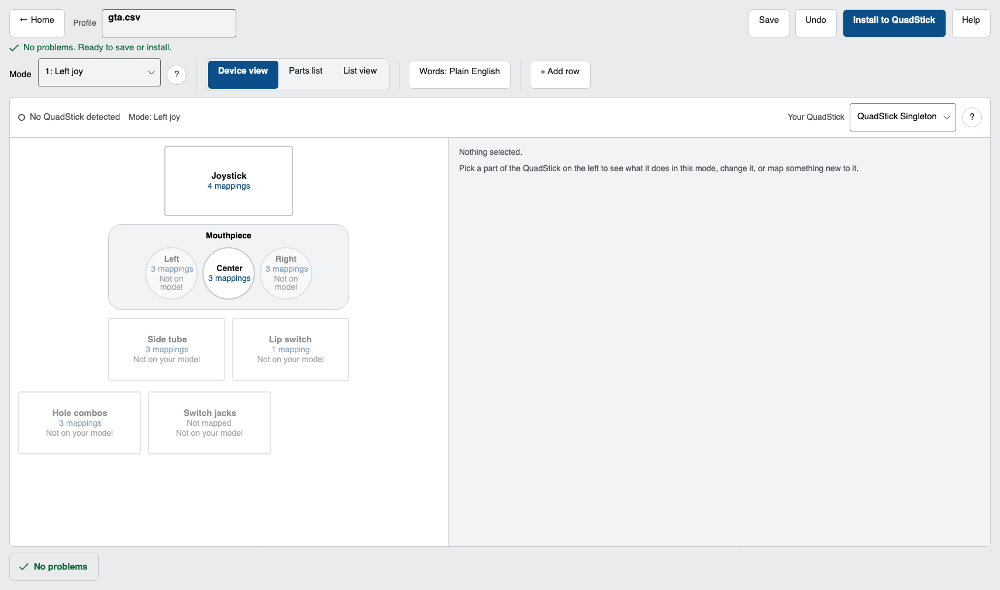
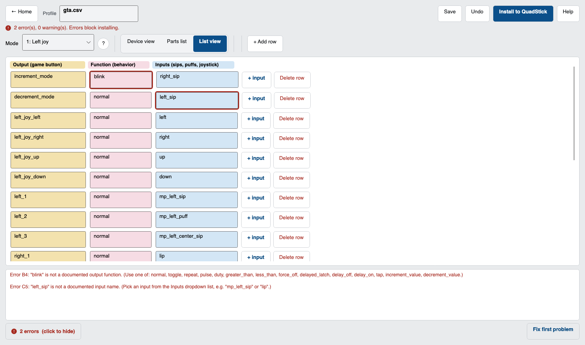
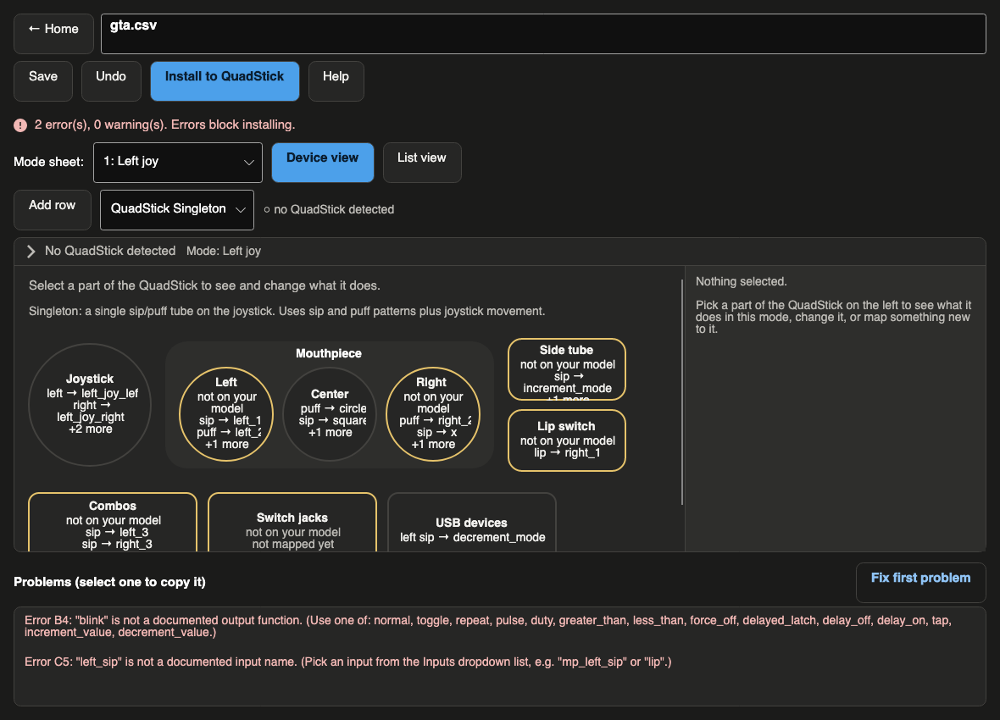

# QuadStick Config Manager

[](https://github.com/Bbrizly/Quadstick-Config-Manager/actions/workflows/build.yml)

Free desktop app for editing and installing [QuadStick](https://www.quadstick.com/) game profiles. Windows and macOS.

Not affiliated with QuadStick or Fred Davison.



## Why this exists

A QuadStick stores its settings in a CSV on the USB drive. Most people edit that in Google Sheets, export with an add-on, and copy the file over with **QMP** — which only runs on Windows. One bad cell can brick a profile. Mess up `default.csv` and the drive can disappear until you do a physical reset.

This is a normal editor that catches mistakes before anything hits the device.

## What you get

Edit profiles in a spreadsheet view or on a picture of the hardware. Autocomplete knows the real input, output, and function names from Fred's validation data.

When something's wrong you get plain English: which cell, what's off, how to fix it. Red outline in the editor. Errors block install.

Install backs up the old file, writes a temp copy, reads it back, then swaps it in. Paste a Google Sheets link on the home screen to import a community profile. Overwriting `default.csv` always asks first.

Big buttons, keyboard shortcuts, screen reader labels — the usual accessibility stuff. Light and dark themes, chosen from the Appearance menu or following your system.




## Download

[Releases](https://github.com/Bbrizly/Quadstick-Config-Manager/releases):

| File | Computer |
|------|----------|
| `QuadStickConfigManager-Windows-x64.zip` | Windows 10/11, 64-bit |
| `QuadStickConfigManager-macOS-AppleSilicon.zip` | Mac, Apple Silicon (M1/M2/M3/M4) |
| `QuadStickConfigManager-macOS-Intel.zip` | Intel Mac |
| `QuadStickConfigManager-Linux-x64.tar.gz` | Linux, 64-bit |

Unzip and run. No installer. Works offline except Sheets import.

**Windows:** SmartScreen may warn on first launch (not code-signed) — More info → Run anyway.

**Mac:** not notarized yet. Right-click → Open → Open the first time. If it says "is damaged", run `xattr -dr com.apple.quarantine "/Applications/QuadStick Config Manager.app"` then open it.

## Build it yourself

Need [.NET 8](https://dotnet.microsoft.com/download/dotnet/8.0).

```bash
make test                    # run tests
make run                     # launch the app
make package                 # build the macOS app locally to test it
make release VERSION=1.2.3   # tag + push; CI builds and publishes every download
```

To ship a version: `make release VERSION=1.2.3` (or just push a `vX.Y.Z` tag). GitHub Actions runs the tests, builds the Windows, macOS, and Linux downloads, and publishes the GitHub Release automatically. Nothing else to do.

Without Make:

```bash
dotnet test
dotnet run --project src/QuadStick.App
```

## Using it

Home screen: new profile, open one from your library (`Documents/QuadStick Profiles`), pick a file on the device, or paste a Sheets link.

Editor has two faces — device view (picture of the stick) and list view (rows and columns). Fix anything red in the Problems panel before you install. Click a problem to copy it for a bug report.

Save goes to your library or wherever you pick. Install needs the QuadStick plugged in; old files land in `~/QuadStickBackups`.

Ctrl/Cmd+O open, S save, N new, Z undo.

## Layout

```
src/QuadStick.Format   parser, validator, USB install
src/QuadStick.App      Avalonia UI
tests/                 unit tests + real profile CSVs
tools/RenderPreview    screenshot helper (dev only)
docs/FORMAT.md         CSV format notes
```

## Tests

Rules come from Fred's validation endpoint, his converter code, and the [user manual](https://www.quadstick.com/online-user-manual). The test corpus is real community profiles. CI runs on every push; pushing a `v*` tag builds and publishes the downloads.

## License

MIT.
