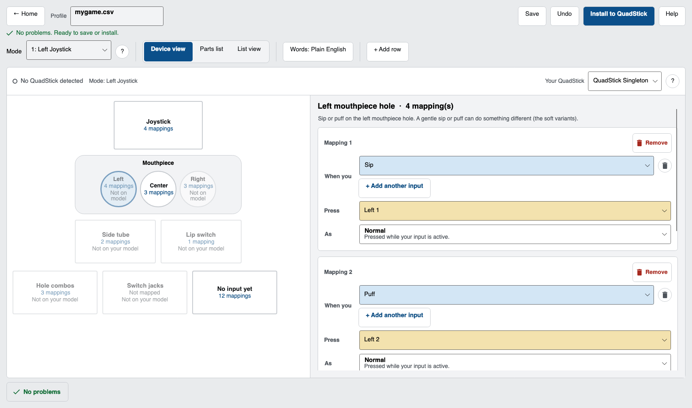

<div align="center">

<picture>
  <source media="(prefers-color-scheme: dark)" srcset="docs/QSLogo-dark.png">
  
</picture>

# QuadStick Config Manager

**A free desktop app for editing and installing [QuadStick](https://www.quadstick.com/) game profiles.**<br>
Windows, macOS, and Linux. Not affiliated with QuadStick or Fred Davison.

[](https://github.com/Bbrizly/Quadstick-Config-Manager/actions/workflows/build.yml)
[](https://github.com/Bbrizly/Quadstick-Config-Manager/releases)
[](LICENSE)

[Website](https://bbrizly.github.io/Quadstick-Config-Manager/) &middot; [Download](https://github.com/Bbrizly/Quadstick-Config-Manager/releases) &middot; [QuadStick.com](https://www.quadstick.com/) &middot; [User manual](https://www.quadstick.com/online-user-manual)

</div>



## Why it exists

A QuadStick keeps its settings in a CSV on its USB drive. The usual way to edit that is Google Sheets plus an export add-on, then copy the file over with QMP, a Windows-only tool. One bad cell can break a profile, and a broken `default.csv` can make the drive vanish until you do a physical reset.

This is a plain editor that catches those mistakes before anything reaches the device.

## What it does

- **Two ways to edit.** Map inputs on a picture of the hardware, or work in a spreadsheet view. Autocomplete knows the real input, output, and function names from Fred's validation data.
- **Plain-English validation.** When something is wrong you get which cell, what is off, and how to fix it. Bad cells turn red. Errors block install.
- **Safe install.** Backs up the old file, writes a temp copy, reads it back, then swaps it in. Overwriting `default.csv` always asks first.
- **Import from Sheets.** Paste a Google Sheets link on the home screen to pull in a community profile.
- **Built for access.** Big buttons, keyboard shortcuts, and screen reader labels throughout. Light and dark themes, following your system or set by hand.


## Download

Grab the latest build from [Releases](https://github.com/Bbrizly/Quadstick-Config-Manager/releases):

| File | For |
|------|-----|
| `QuadStickConfigManager-Windows-x64.zip` | Windows 10/11, 64-bit |
| `QuadStickConfigManager-macOS-AppleSilicon.zip` | Mac, Apple Silicon (M1 to M4) |
| `QuadStickConfigManager-macOS-Intel.zip` | Intel Mac |
| `QuadStickConfigManager-Linux-x64.tar.gz` | Linux, 64-bit |

Unzip and run. No installer. Works offline except for Sheets import.

**Windows:** SmartScreen may warn on first launch (not code-signed). Click More info, then Run anyway.

**Mac:** not notarized yet. Right-click, Open, then Open again the first time. If it says the app is damaged, run this once and reopen:

```bash
xattr -dr com.apple.quarantine "/Applications/QuadStick Config Manager.app"
```

## Using it

The home screen lets you start a new profile, open a file, pick your library (`Documents/QuadStick Profiles`), or paste a Sheets link.

The editor has a device view (a picture of the stick) and a list view (rows and columns). Fix anything red in the Problems panel before you install. Click a problem to copy it for a bug report.

Save goes to your library or wherever you choose. Install needs the QuadStick plugged in; old files land in `~/QuadStickBackups`.

Shortcuts: `Ctrl/Cmd+O` open, `S` save, `N` new, `Z` undo, `I` install, `D` switch views, `H` or `F1` for help.

## Build from source

Needs [.NET 8](https://dotnet.microsoft.com/download/dotnet/8.0).

```bash
make test                    # run the tests
make run                     # launch the app
make package                 # build the macOS app locally to smoke-test it
make release VERSION=1.2.3   # tag and push; CI builds and publishes every download
```

Pushing a `vX.Y.Z` tag is the whole release process. GitHub Actions runs the tests, builds the Windows, macOS, and Linux downloads, and publishes the release. Without Make:

```bash
dotnet test
dotnet run --project src/QuadStick.App
```

## Layout

```
src/QuadStick.Format   parser, validator, USB install
src/QuadStick.App      Avalonia UI
tests/                 unit tests and real profile CSVs
tools/RenderPreview    screenshot helper (dev only)
docs/FORMAT.md         notes on the CSV format
```

Validation rules come from Fred's validation endpoint, his converter code, and the [user manual](https://www.quadstick.com/online-user-manual). The test corpus is real community profiles.

## License

MIT. See [LICENSE](LICENSE).
</content>
</invoke>
