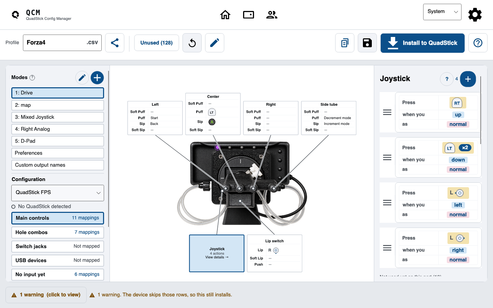
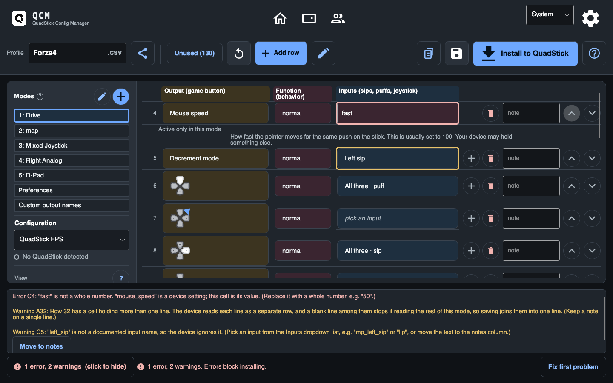
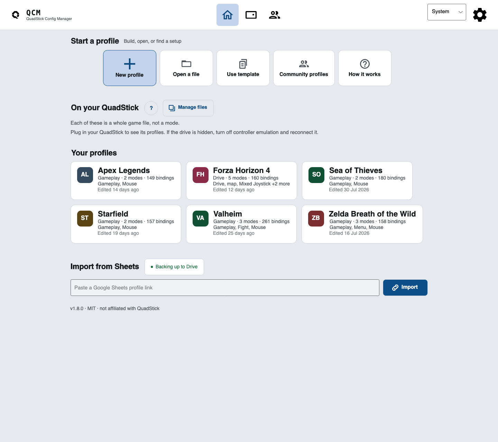

<div align="center">

<picture>
  <source media="(prefers-color-scheme: dark)" srcset="docs/QSLogo-dark.png">
  
</picture>

# Quadstick: Config Manager

**A free desktop app for editing and installing [QuadStick](https://www.quadstick.com/) game profiles.**<br>
Windows, macOS, and Linux. Not affiliated with QuadStick or Fred Davison.

[](https://github.com/Bbrizly/Quadstick-Config-Manager/actions/workflows/build.yml)
[](https://github.com/Bbrizly/Quadstick-Config-Manager/releases)
[](LICENSE)

[Website](https://bbrizly.github.io/Quadstick-Config-Manager/) &middot; [Download](https://github.com/Bbrizly/Quadstick-Config-Manager/releases) &middot; [Mac App Store](https://apps.apple.com/ca/app/quadstick-config-manager/id6791035050?mt=12) &middot; [Microsoft Store](https://apps.microsoft.com/detail/9ppqzqnl4wkp?hl=en-US&gl=EG&ocid=pdpshare) &middot; [QuadStick.com](https://www.quadstick.com/) &middot; [User manual](https://www.quadstick.com/online-user-manual)

</div>



## Why it exists

A QuadStick keeps its settings in a CSV on its USB drive. The usual way to edit that is Google Sheets plus an export add-on, then copy the file over with QMP, a Windows-only tool. One bad cell can break a profile, and a broken `default.csv` can make the drive vanish until you do a physical reset.

This is a plain editor that catches those mistakes before anything reaches the device.

## What it does

- **Two ways to edit.** Map inputs on a picture of the hardware, or work in a spreadsheet view. Autocomplete knows the real input, output, and function names from Fred's validation data.
- **Plain-English validation.** When something is wrong you get which cell, what is off, and how to fix it. Bad cells turn red. An error means the device would misread the file, and only those block install. A row the device simply skips, like a leftover template row or a note typed in an input column, is a warning and installs fine.
- **Safe install.** Backs up the old file, writes a temp copy, reads it back, then swaps it in. Overwriting `default.csv` always asks first.
- **Google Drive backup.** Connect once and every save backs itself up to a Sheet in your Drive. The save never waits on the network, and a failed backup retries on the next one. New machine or a wiped USB stick: restore everything from Drive.
- **Share and import.** Copy a share link for any profile, or paste someone else's link on the home screen to pull theirs in. Every mode tab comes in, the way most shared profiles are laid out. Open takes a downloaded `.xlsx` workbook too.
- **Community profiles.** Browse the QuadStick maker's own catalog of shared game profiles from inside the app. The list is only fetched when you open or refresh that window, and the last good copy is kept on your computer so it still opens offline. Import brings a profile into the editor, same as pasting a share link.
- **Function numbers explained.** Pick a behavior like `repeat` or `greater_than` and the box for its numbers says what each one changes, the range the device accepts, and what it does when you leave the number out. All of it read off the firmware, so `greater_than 250` is called out as a strength no input reaches.
- **The back panel, in a picture.** A photo of the back with every socket named. One switch in the top jack arrives as `digital_in_8`, one in the bottom as `digital_in_1`, and the middle jack is the lip switch. The second number in a jack is only used with a splitter. A joystick in the rear USB-A port is `usb_1_up`, `down`, `left`, `right`.
- **USB or Bluetooth, per mode.** Each mode says which connection its presses travel over. A mode on Bluetooth alone sends no mouse or keyboard over a cable on 2025 firmware, and the app says so.
- **Device settings, with real controls.** `prefs.csv` holds the QuadStick's own settings, not a game profile. Settings the app recognizes get a number box, checkbox, or dropdown instead of a plain cell; anything it does not recognize keeps a plain text box and is left exactly as it was. Installing `prefs.csv` back to the device always asks first, because it changes every profile at once.
- **Manage files on a mounted QuadStick.** See every profile on the device, grouped by drive, and copy one to your library, open its linked Sheet, or delete it. Delete backs the file up first. `default.csv` and `prefs.csv` are protected and can't be deleted from the app.
- **Built for access.** Big buttons, keyboard shortcuts, and screen reader labels throughout. Light and dark themes, following your system or set by hand.



## Download

Also on the [Mac App Store](https://apps.apple.com/ca/app/quadstick-config-manager/id6791035050?mt=12) and [Microsoft Store](https://apps.microsoft.com/detail/9ppqzqnl4wkp?hl=en-US&gl=EG&ocid=pdpshare).

Or grab the latest build from [Releases](https://github.com/Bbrizly/Quadstick-Config-Manager/releases):

| File | For |
|------|-----|
| `QuadStickConfigManager-Windows-x64.zip` | Windows 10/11, 64-bit |
| `QuadStickConfigManager-macOS-AppleSilicon.zip` | Mac, Apple Silicon (M1 to M4) |
| `QuadStickConfigManager-macOS-Intel.zip` | Intel Mac |
| `QuadStickConfigManager-Linux-x64.tar.gz` | Linux, 64-bit |

Unzip and run. No installer. Works offline except for Sheets import, Drive
backup, and the optional usage data you can turn on or leave off.

**Windows:** SmartScreen may warn on first launch (not code-signed). Click More info, then Run anyway.

**Mac:** not notarized yet. Right-click, Open, then Open again the first time. If it says the app is damaged, run this once and reopen:

```bash
xattr -dr com.apple.quarantine "/Applications/Quadstick Config Manager.app"
```

## Using it

The home screen lets you start a new profile, open a file, pick your library (`Documents/QuadStick Profiles`), or paste a Sheets link.



The editor has a device view (a picture of the stick) and a list view (rows and columns). Fix anything red in the Problems panel before you install. Click a problem to copy it for a bug report.

Save goes to your library or wherever you choose. Install needs the QuadStick plugged in; old files land in `~/QuadStickBackups`.

Manage files and the device settings controls need a **mounted** QuadStick: the drive has to show up like a USB stick in Finder or File Explorer. This app only ever reads and writes files there, nothing else. If the drive is hidden, for example in PS4 boot mode or with controller emulation on, this app cannot see it at all; turn that off in QMP or your prefs and replug. There is no other way in from here. Deleting a file from Manage files backs it up to `~/QuadStickBackups` first, the same folder Install uses. `default.csv` and `prefs.csv` are protected and can't be deleted from the app.

Shortcuts: `Ctrl/Cmd+O` open, `S` save, `N` new, `Z` undo, `I` install, `D` switch views, `H` or `F1` for help.

## Build from source

Needs [.NET 8](https://dotnet.microsoft.com/download/dotnet/8.0).

```bash
make test                    # run the tests
make run                     # launch the app
make package                 # build the macOS app locally to smoke-test it
make release VERSION=1.2.3   # tag and push; CI builds and publishes every download
```

Pushing a `vX.Y.Z` tag is the whole release process. GitHub Actions runs the tests, builds the Windows, macOS, and Linux downloads, and publishes the release. Without Make:

```bash
dotnet test
dotnet run --project src/QuadStick.App
```

## Layout

```
src/QuadStick.Format   parser, validator, USB install
src/QuadStick.App      Avalonia UI
tests/                 unit tests and real profile CSVs
tools/RenderPreview    screenshot helper (dev only)
docs/FORMAT.md         notes on the CSV format
```

Validation rules come from Fred's validation endpoint, his converter code, and the [user manual](https://www.quadstick.com/online-user-manual). The test corpus is real community profiles.

## License

MIT. See [LICENSE](LICENSE).
