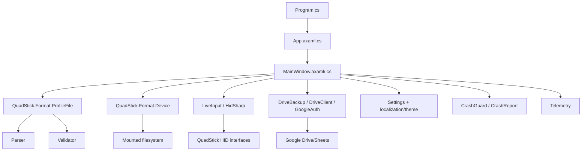

# Current architecture

## Observed shape

## Architectural strengths

1. Format semantics have a separate assembly and strong tests.
2. `ProfileFile` centralizes edits and undo instead of letting UI write CSV ad hoc.
3. Device installs perform significantly stronger safety checks than a naïve file copy.
4. HID live input is descriptor-aware.
5. Remote telemetry has explicit consent and event-property allowlists.
6. Google token storage is platform protected on Windows/macOS.

## Coupling to remove

### MainWindow as god object

`MainWindow` owns `ProfileFile`, save path, sheet index, view mode, selected zone, label vocabulary, hardware model, settings, UI scale, reduce-motion state, Google backup object/task and numerous direct filesystem/UI callbacks. Partial classes reduce file size in places but not ownership coupling.

### Format assembly mixes pure logic and OS I/O

`QuadStick.Format.Device` knows `DriveInfo`, OS mount conventions, paths, backups and deletion. Target must separate these from CSV semantics so `qcm-config` is deterministic and portable.

### UI invokes concrete services

Current UI code directly constructs Google auth/client, manipulates files, dispatches background tasks and uses Avalonia storage/dialog APIs. In target, those become application use cases behind QcmClient.

## State currently worth preserving semantically

- one active profile with source/save identity;
- selected sheet/mode and device/list/rail presentation state;
- label vocabulary style;
- dirty + undo + revision state in `ProfileFile`;
- app settings/theme/language/accessibility choices;
- backup connection/link/dirty-retry state;
- device mount candidates/library state;
- live HID state.

The target must distinguish **canonical native state** from **ephemeral presentation state** rather than blindly mirror these fields.