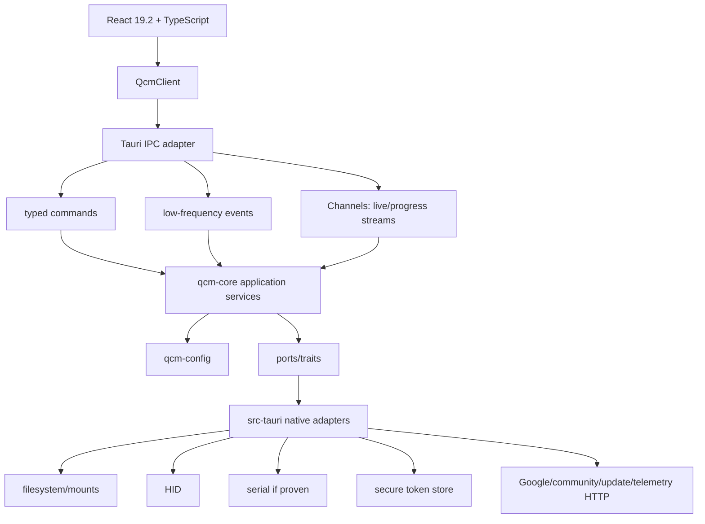

# Target architecture

## Selected architecture

## Package boundaries

### `crates/qcm-config`

Pure deterministic code. Owns raw grid, CSV, firmware-aware parse/validate/normalize, modes/bindings/preferences/IR, edit operations, undo primitives, vocab/templates and safe file-name domain rules. **Forbidden:** Tauri, OS paths/mount enumeration, HTTP, UI, HID/serial.

### `crates/qcm-core`

Application use cases and long-lived state. Owns profile sessions, revisions, device identities/capabilities, install transaction orchestration, library operations, cloud backup policy, settings contracts, typed errors and confirmation requirements. Depends on `qcm-config`; depends on traits, not concrete Tauri adapters.

### `crates/qcm-testkit`

Golden fixtures, firmware-oracle exports/canonical snapshots, fake device storage, fake HID/live stream, fake cloud/secure store and fault injection. Production crates must not depend on it.

### `src-tauri`

Tauri shell, command registry, capability files and concrete adapters: filesystem/mount detection, HID, optional serial, secure storage, system browser, network, updater, logs. Converts core errors to stable IPC errors.

### `/src` frontend

React app, components, SVG visualizer, feature coordinators, accessibility/i18n/theme and ephemeral UI state. Only `src/platform/qcmClient.ts` imports Tauri APIs.

## State ownership

| State | Owner |
|---|---|
| raw CSV/grid + parsed document + issues + undo + revision | Rust profile session |
| actual path/mount/handle/token | Rust/native only |
| device candidate/capability state | Rust device manager |
| persisted settings | Rust settings service; frontend receives DTO |
| selected UI panel, hover, open popover, draft text before commit | React |
| live HID latest frame | streaming adapter/local visualizer state, not global React context |

## IPC policy

- **Commands:** typed request/response and explicit side effects.
- **Events:** low-rate invalidation/state changes only (`devices-changed`, `settings-changed` if needed).
- **Channels:** live HID frames, operation progress, other ordered streams.
- No generic `read_file`, `write_file`, `open_serial`, `exec`, or `http(url)` frontend commands.

## Concurrency policy

Core services own operation gates; UI disabling is advisory, not synchronization. Device mutation is serialized per logical device. Live HID can run independently if platform/resource constraints allow. No lock is held across interactive UI confirmation or slow HTTP.

## Failure policy

Errors cross IPC as stable structured `QcmErrorDto { code, message, recoverable, action?, operationId? }`. Raw paths, secrets and debug dumps do not become normal user messages.