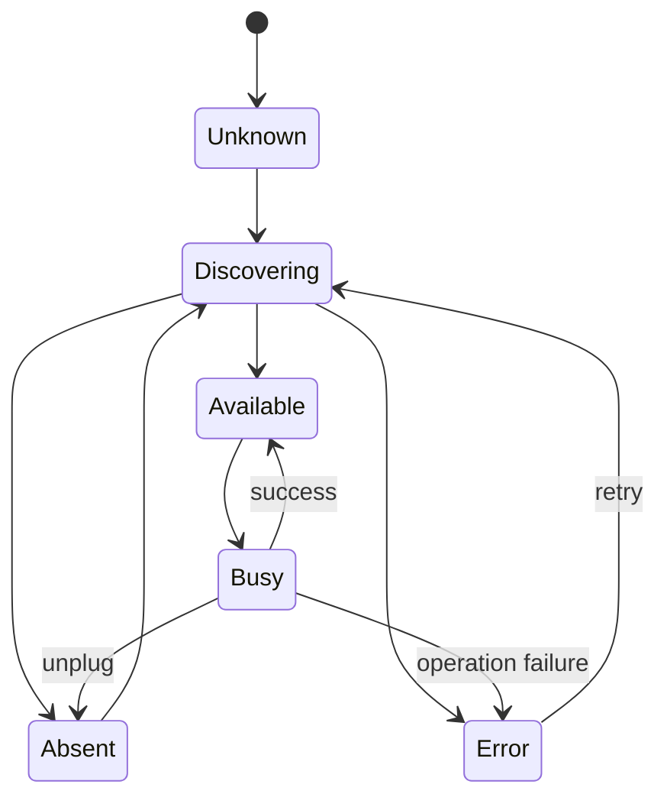
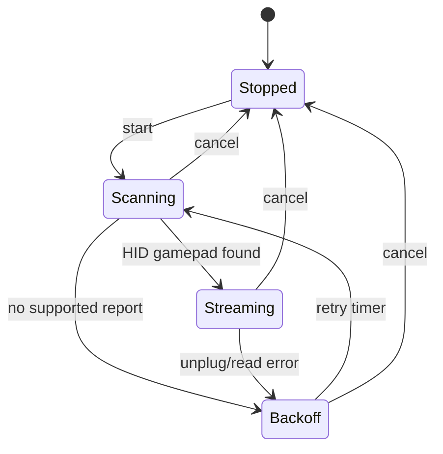

# Connection / capability state machines

Current QCM does **not** need one universal serial-style `Connected` state. Model storage and live HID independently.

## Storage state

### `Busy` operations

`Reading`, `Installing`, `Deleting`, `Reordering`, `ReadingPreferences`, `WritingPreferences` as needed. Core serializes destructive storage work **per storage device**.

## HID live-input state

Expected current retry parity: roughly 1.5 s when no device, 1 s after disconnect, 2 s after unexpected exception; exact timing can be B improvement after characterization.

## Operation rules

- Install/delete cannot overlap on same storage ID.
- Read/list may be serialized during mutation to avoid observing half-transactions.
- HID streaming may continue while storage writes **unless hardware/platform testing shows interface contention**.
- Cloud backup must not hold a device/storage lock.
- UI disabled buttons are not locking; core returns `QCM_DEVICE_BUSY` if races occur.

## Stale operation rule

Each operation has `OperationId` and captures device generation/fingerprint. A late completion from an old generation cannot overwrite current state.

## Shutdown

Cancellation order:
1. reject new commands;
2. cancel discovery/live streams;
3. finish or safely abort non-destructive work;
4. storage transaction either reaches verified commit or executes its documented restore/failure path;
5. bounded diagnostics flush;
6. close native resources.