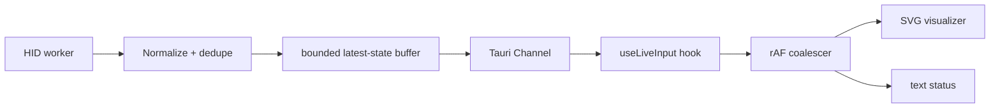

# Live device telemetry / practice pipeline

This document uses “telemetry” for **local live QuadStick state**, distinct from product analytics in `35-observability-and-diagnostics.md`.

## Current parity source

Current live state is HID gamepad output (`LiveInput.cs`), not pressure/sip sensor telemetry. It can reliably show joystick output and output buttons; it cannot infer the user's physical sip hole solely from the HID button report.

Any future firmware serial frame such as sip/puff pressures is a **B/new capability**, not a fact of current parity, until a protocol is shipped and tested.

## Target architecture

## Backpressure

Live input is state, not an audit log. If frontend cannot consume every report, keep the newest state rather than grow an unbounded queue. Sequence number lets UI detect dropped intermediate frames; dropped intermediate frames are acceptable if latest state is current.

## Staleness

If no successful frame within a configured interval while stream is expected, UI marks state stale/unavailable and clears active highlight. Disconnect must never leave a button visually “stuck.”

## UI render budget

Do not `setState` for every device packet across the whole app. The live-input hook stores latest frame in a local external/ref buffer and paints at most once per animation frame. Only derived state needed outside visualizer enters React state.

## Future richer practice mode

If firmware later exposes physical sensors/active mode LEDs through serial/BLE:
1. define a new native transport capability;
2. parse into a separate `PhysicalInputFrame` type;
3. merge presentation only after clock/staleness semantics are defined;
4. never pretend HID output == physical sensor activation.

## Tests

Synthetic 20/60/250 Hz streams, slow consumer, disconnect with active button, reconnect, duplicate frame flood, timestamp regression, frontend unmount/remount and reduced motion.