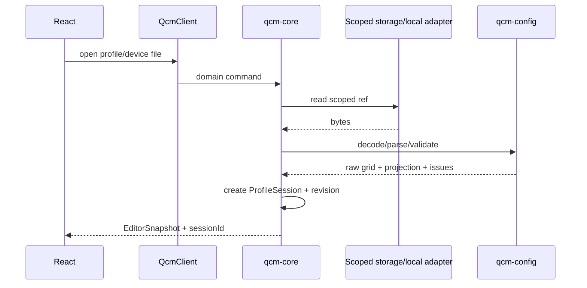

# Config read flow

```mermaid
sequenceDiagram
  participant U as React
  participant Q as QcmClient
  participant C as qcm-core
  participant S as Scoped storage/local adapter
  participant F as qcm-config
  U->>Q: open profile/device file
  Q->>C: domain command
  C->>S: read scoped ref
  S-->>C: bytes
  C->>F: decode/parse/validate
  F-->>C: raw grid + projection + issues
  C->>C: create ProfileSession + revision
  C-->>U: EditorSnapshot + sessionId
```

Raw native path stays behind adapter.