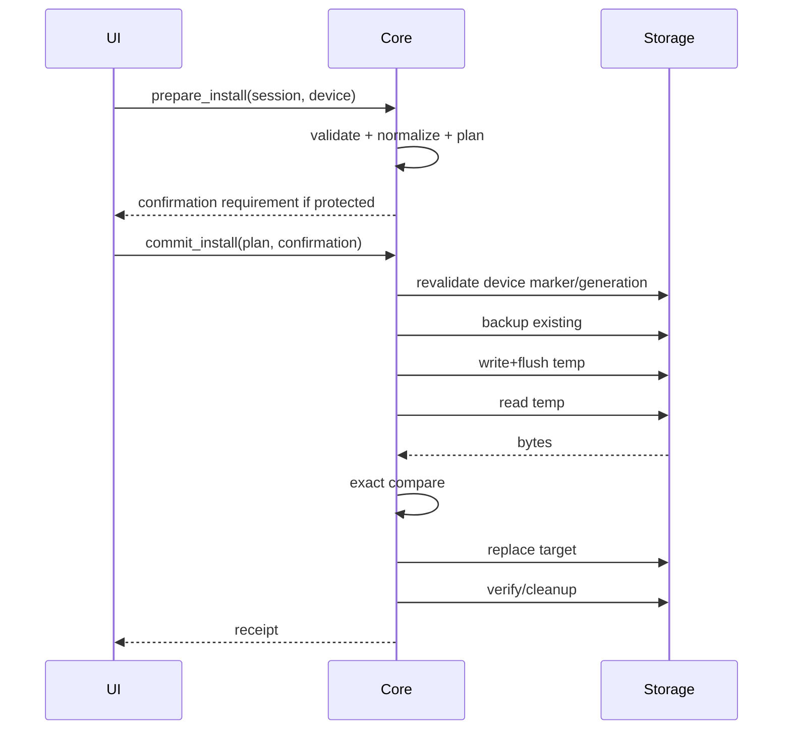

# Device config write flow

```mermaid
sequenceDiagram
  participant U as UI
  participant C as Core
  participant S as Storage
  U->>C: prepare_install(session, device)
  C->>C: validate + normalize + plan
  C-->>U: confirmation requirement if protected
  U->>C: commit_install(plan, confirmation)
  C->>S: revalidate device marker/generation
  C->>S: backup existing
  C->>S: write+flush temp
  C->>S: read temp
  S-->>C: bytes
  C->>C: exact compare
  C->>S: replace target
  C->>S: verify/cleanup
  C-->>U: receipt
```

Failures before/during replace follow explicit restore-state contract.