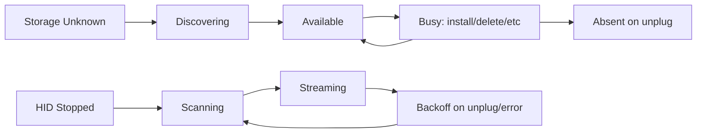

# Capability connection flow

```mermaid
flowchart LR
  S0[Storage Unknown] --> SD[Discovering] --> SA[Available]
  SA --> SB[Busy: install/delete/etc] --> SA
  SB --> SX[Absent on unplug]
  H0[HID Stopped] --> HS[Scanning] --> HH[Streaming]
  HH --> HB[Backoff on unplug/error] --> HS
```

QCM intentionally has no invented single universal Connected state.