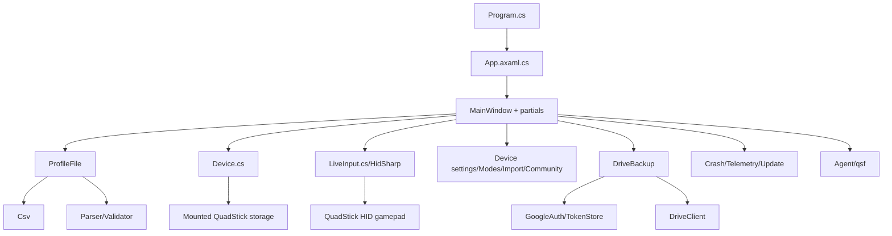

# Current system

```mermaid
flowchart TD
  P[Program.cs] --> A[App.axaml.cs]
  A --> M[MainWindow + partials]
  M --> PF[ProfileFile]
  PF --> CSV[Csv]
  PF --> PAR[Parser/Validator]
  M --> DEV[Device.cs]
  DEV --> FS[Mounted QuadStick storage]
  M --> LI[LiveInput.cs/HidSharp]
  LI --> HID[QuadStick HID gamepad]
  M --> DS[Device settings/Modes/Import/Community]
  M --> DB[DriveBackup]
  DB --> GA[GoogleAuth/TokenStore]
  DB --> DC[DriveClient]
  M --> CT[Crash/Telemetry/Update]
  M --> AG[Agent/qsf]
```

Primary coupling: MainWindow owns both presentation and substantial orchestration; `QuadStick.Format.Device` mixes pure domain and OS filesystem work.