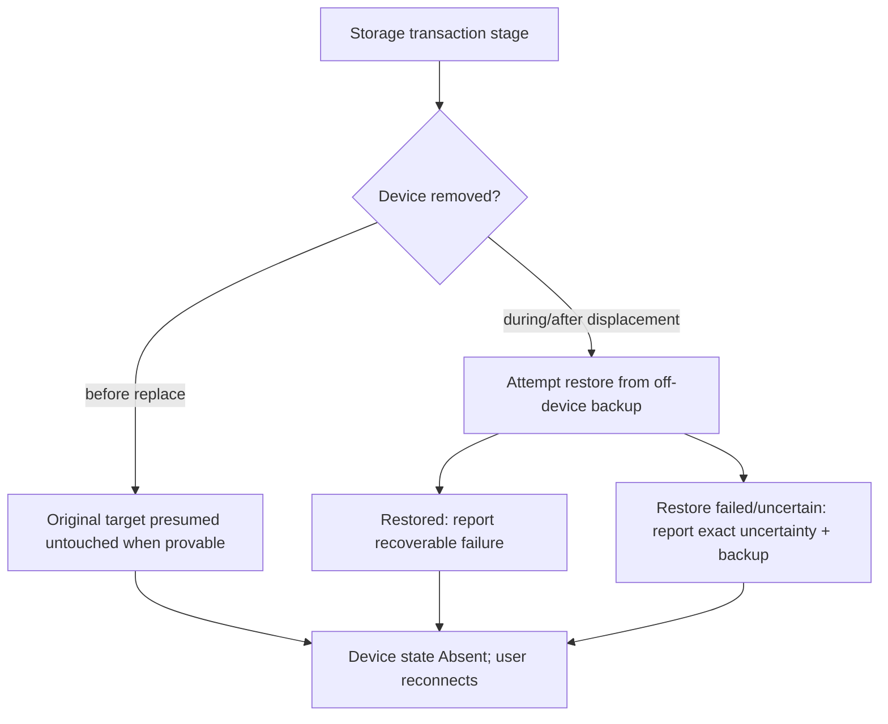

# Disconnect recovery

```mermaid
flowchart TD
  IO[Storage transaction stage] --> D{Device removed?}
  D -- before replace --> U[Original target presumed untouched when provable]
  D -- during/after displacement --> R[Attempt restore from off-device backup]
  R --> OK[Restored: report recoverable failure]
  R --> BAD[Restore failed/uncertain: report exact uncertainty + backup]
  U --> ABS[Device state Absent; user reconnects]
  OK --> ABS
  BAD --> ABS
```

Never convert an uncertain mid-swap failure into a generic “try again” success-like message.