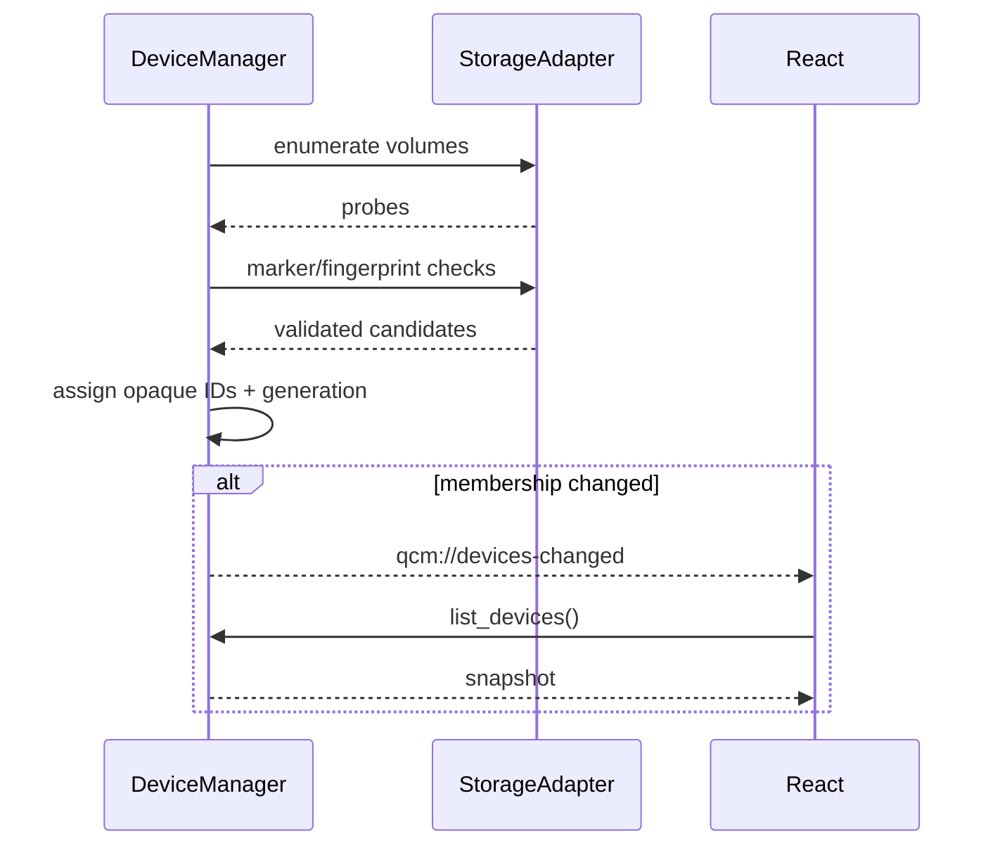

# Discovery flow

```mermaid
sequenceDiagram
  participant C as DeviceManager
  participant A as StorageAdapter
  participant U as React
  C->>A: enumerate volumes
  A-->>C: probes
  C->>A: marker/fingerprint checks
  A-->>C: validated candidates
  C->>C: assign opaque IDs + generation
  alt membership changed
    C-->>U: qcm://devices-changed
    U->>C: list_devices()
    C-->>U: snapshot
  end
```

Destructive operation always performs a fresh revalidation after this display discovery.