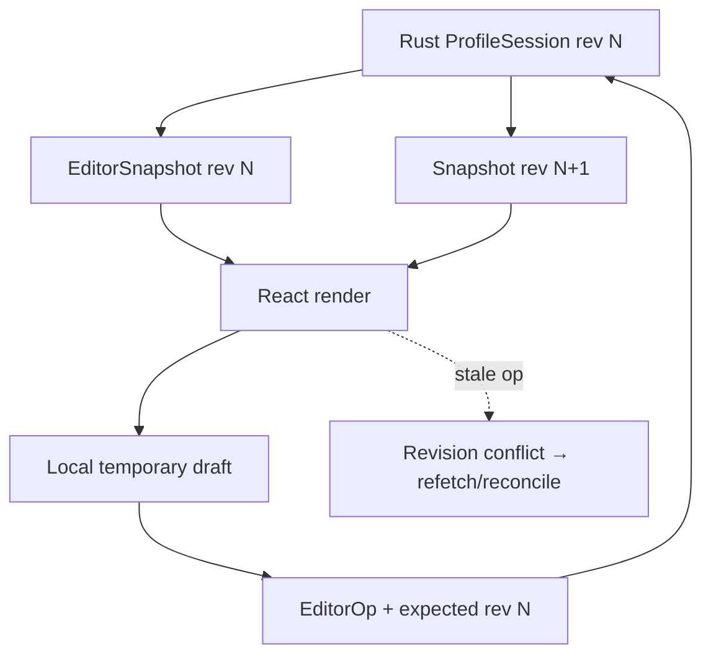

# Frontend state flow

```mermaid
flowchart TD
  RS[Rust ProfileSession rev N] --> SNAP[EditorSnapshot rev N]
  SNAP --> UI[React render]
  UI --> DRAFT[Local temporary draft]
  DRAFT --> OP[EditorOp + expected rev N]
  OP --> RS
  RS --> SNAP2[Snapshot rev N+1]
  SNAP2 --> UI
  UI -. stale op .-> ERR[Revision conflict → refetch/reconcile]
```

Dirty/undo/serialization remain native truth.