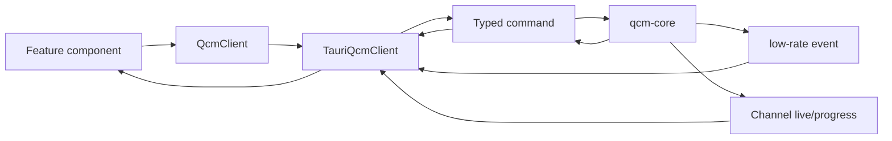

# IPC flow

```mermaid
flowchart LR
  F[Feature component] --> Q[QcmClient]
  Q --> T[TauriQcmClient]
  T --> C[Typed command]
  C --> R[qcm-core]
  R --> C
  C --> T
  R --> E[low-rate event] --> T
  R --> H[Channel live/progress] --> T
  T --> F
```

Only `src/platform/tauriQcmClient.ts` imports Tauri APIs.