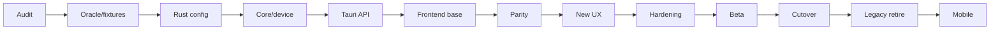

# Migration sequence

```mermaid
flowchart LR
  P0[Audit] --> P1[Oracle/fixtures] --> P2[Rust config] --> P3[Core/device] --> P4[Tauri API] --> P5[Frontend base] --> P6[Parity] --> P7[New UX] --> P8[Hardening] --> P9[Beta] --> P10[Cutover] --> P11[Legacy retire] --> P12[Mobile]
```

Every arrow is a GO gate, not a calendar suggestion.