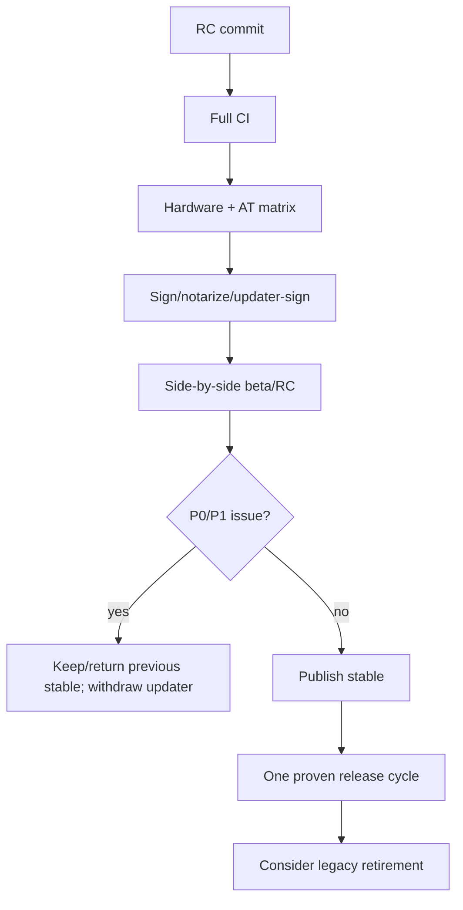

# Release/cutover flow

```mermaid
flowchart TD
  RC[RC commit] --> CI[Full CI]
  CI --> HW[Hardware + AT matrix]
  HW --> SIGN[Sign/notarize/updater-sign]
  SIGN --> BETA[Side-by-side beta/RC]
  BETA --> R{P0/P1 issue?}
  R -- yes --> PREV[Keep/return previous stable; withdraw updater]
  R -- no --> STABLE[Publish stable]
  STABLE --> CYCLE[One proven release cycle]
  CYCLE --> RETIRE[Consider legacy retirement]
```

Previous stable artifact remains available through cutover.