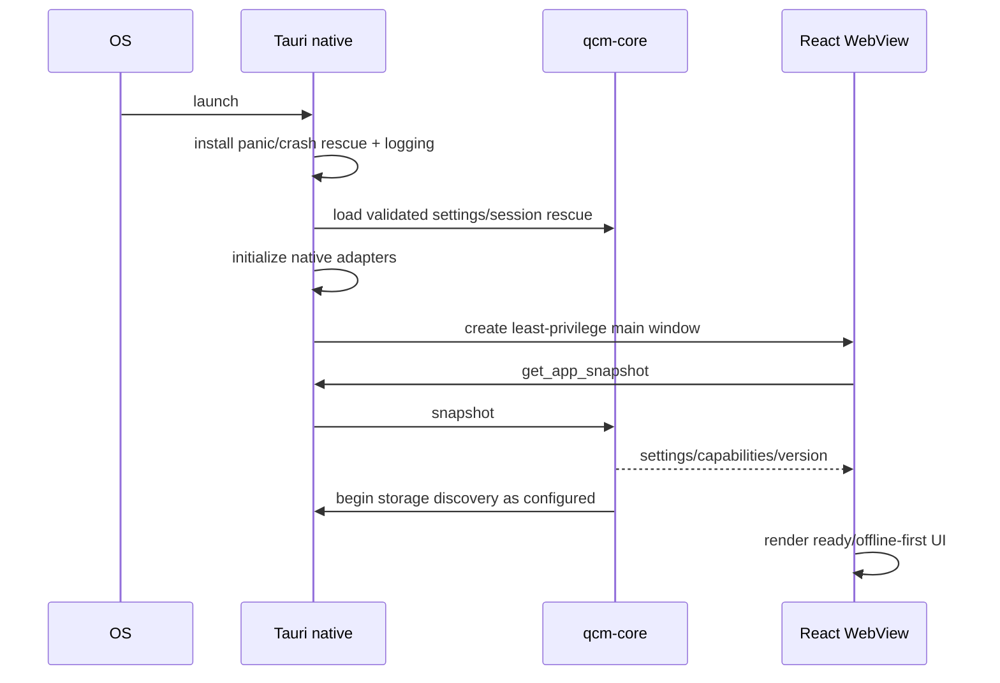

# Startup flow

```mermaid
sequenceDiagram
  participant OS
  participant T as Tauri native
  participant C as qcm-core
  participant W as React WebView
  OS->>T: launch
  T->>T: install panic/crash rescue + logging
  T->>C: load validated settings/session rescue
  T->>T: initialize native adapters
  T->>W: create least-privilege main window
  W->>T: get_app_snapshot
  T->>C: snapshot
  C-->>W: settings/capabilities/version
  C->>T: begin storage discovery as configured
  W->>W: render ready/offline-first UI
```

No analytics/community/Google network is started merely by home-screen launch.