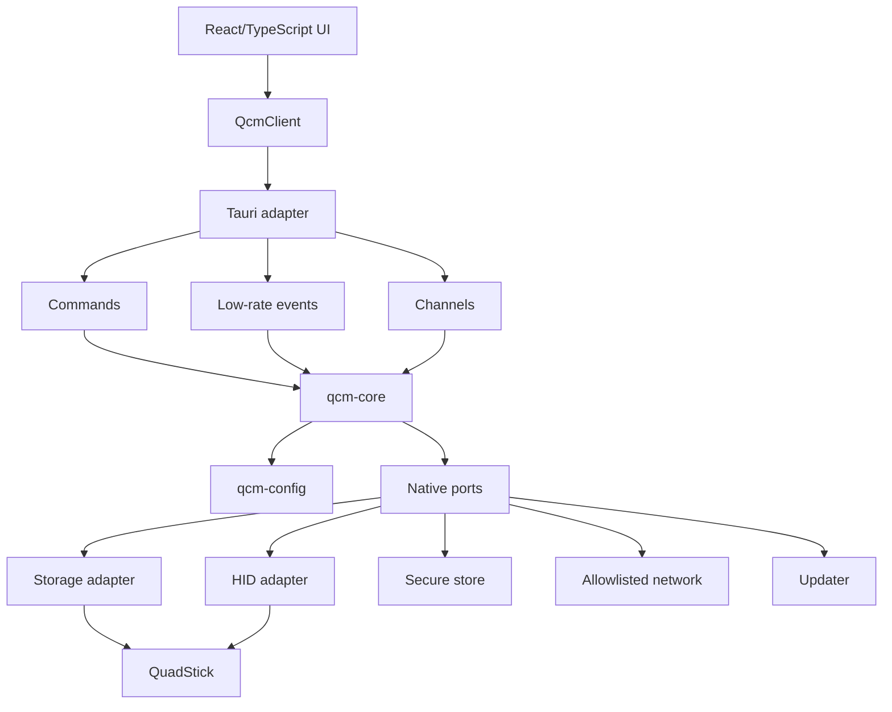

# Target system

```mermaid
flowchart TD
  UI[React/TypeScript UI] --> QC[QcmClient]
  QC --> IPC[Tauri adapter]
  IPC --> CMD[Commands]
  IPC --> EVT[Low-rate events]
  IPC --> CH[Channels]
  CMD --> CORE[qcm-core]
  EVT --> CORE
  CH --> CORE
  CORE --> CFG[qcm-config]
  CORE --> PORT[Native ports]
  PORT --> ST[Storage adapter]
  PORT --> HD[HID adapter]
  PORT --> SS[Secure store]
  PORT --> NW[Allowlisted network]
  PORT --> UP[Updater]
  ST --> QS[QuadStick]
  HD --> QS
```

Dependency direction is inward; adapters depend on core contracts, core depends on pure config.