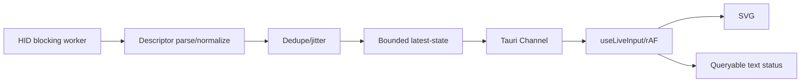

# Local live-input flow

```mermaid
flowchart LR
  H[HID blocking worker] --> P[Descriptor parse/normalize]
  P --> D[Dedupe/jitter]
  D --> B[Bounded latest-state]
  B --> C[Tauri Channel]
  C --> R[useLiveInput/rAF]
  R --> S[SVG]
  R --> T[Queryable text status]
```

This is local device state, not product analytics.